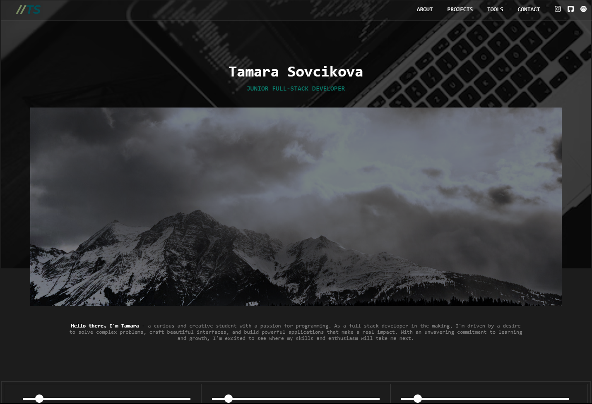

<h1 align="center">
  Tamara Sovcikova - Personal Website
   
</h1>

  <a href="#about">About</a> •
  <a href="#features">Features</a> •
  <a href="#technologies-used">Technologies Used</a> •
  <a href="#contact-me">Contact Me</a> 

  

## About 

👋 Hey! This is my first official website to help showcase my skills, it is still in progress but definitely worth a check.

## Features

💡 Here are some of the features of my website:
- A brief description of who I am and what I do
- A collection of my projects with detailed information about each one
- A contact form to get in touch with me
- A list of the programming languages and tools I use

## Technologies Used
- HTML
- CSS
- JavaScript
- Bootstrap
- 📧 For handling the contact form submissions, I use an email service called Formspree.

## Contact Me

📬 If you want to get in touch with me, you can fill out the contact form on my website or reach me via:

- Email: tamara@sovcik.com

🤝 I'm always open to new opportunities and want to improve my skills further, so feel free to reach out!
   

Made with ❤️ and 🍫
